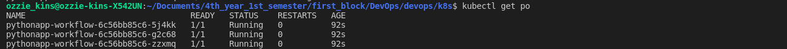
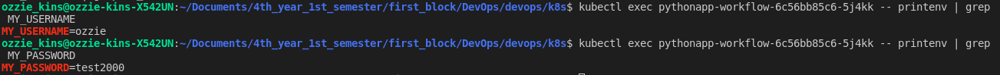
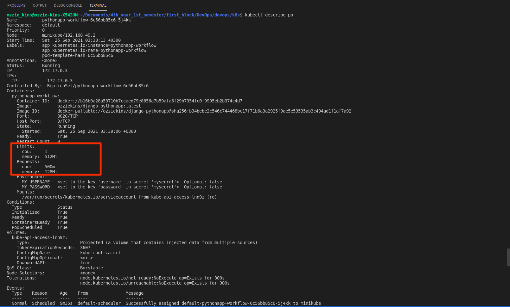

# K8s secrets and resources     

Name: Ozioma Okonicha  
Group: B18-SE01  
Lab 11   

## Using CLI 

Commands:

```sh
minikube start
echo -n 'ozzie' > ./secrets/username.txt
echo -n 'test2000' > ./secrets/password.txt

kubectl create secret generic django-user-pass \
  --from-file=username=./secrets/username.txt \
  --from-file=password=./secrets/password.txt

kubectl get secrets

kubectl describe secrets/django-user-pass

kubectl get secret django-user-pass -o jsonpath='{.data}'
```

Result of `kubectl get secrets`:  
```
NAME                                       TYPE                                  DATA   AGE
default-token-zhfgj                        kubernetes.io/service-account-token   3      4d9h
django-user-pass                           Opaque                                2      88s
pythonapp-workflow-token-vxj6x             kubernetes.io/service-account-token   3      4d8h
sh.helm.release.v1.pythonapp-workflow.v1   helm.sh/release.v1                    1      4d8h
```

Result of `kubectl describe secrets/django-user-pass`: 
```sh
Name:         django-user-pass
Namespace:    default
Labels:       <none>
Annotations:  <none>

Type:  Opaque

Data
====
password:  8 bytes
username:  5 bytes
```

## Using helm  

```sh
minikube start
helm package pythonapp-workflow
helm install pythonapp-workflow ./pythonapp-workflow-0.1.0.tgz 
kubectl get po
```

Result of `kubectl get po`:  
```
NAME                                  READY   STATUS    RESTARTS   AGE
pythonapp-workflow-6c56bb85c6-5j4kk   1/1     Running   0          92s
pythonapp-workflow-6c56bb85c6-g2c68   1/1     Running   0          92s
pythonapp-workflow-6c56bb85c6-zzxmq   1/1     Running   0          92s
```

  

Result of `kubectl exec pythonapp-workflow-6c56bb85c6-5j4kk -- printenv | grep MY_USERNAME`:  
```
MY_USERNAME=ozzie
```

  

## CPU and memory  

```sh
resources:
    limits:
        cpu: "1"
        memory: "512Mi"
    requests:
        cpu: "0.5"
        memory: "128Mi"
```

  
