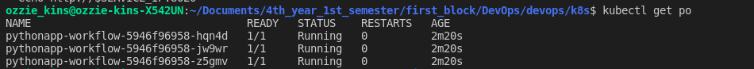
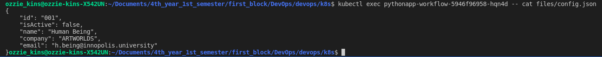

# K8s ConfigMaps    

Name: Ozioma Okonicha  
Group: B18-SE01  
Lab 12   

## Using CLI 

Commands:

```sh
minikube start
helm package pythonapp-workflow
helm install pythonapp-workflow ./pythonapp-workflow-0.1.0.tgz 
kubectl get po
```

Result of `kubectl get po`:  
```
NAME                                  READY   STATUS    RESTARTS   AGE
pythonapp-workflow-5946f96958-hqn4d   1/1     Running   0          2m20s
pythonapp-workflow-5946f96958-jw9wr   1/1     Running   0          2m20s
pythonapp-workflow-5946f96958-z5gmv   1/1     Running   0          2m20s
```

  


Result of `kubectl exec pythonapp-workflow-5946f96958-hqn4d -- cat files/config.json`:  
```sh
{
    "id": "001",
    "isActive": false,
    "name": "Human Being",
    "company": "ARTWORLDS",
    "email": "h.being@innopolis.university"
}
```

  
