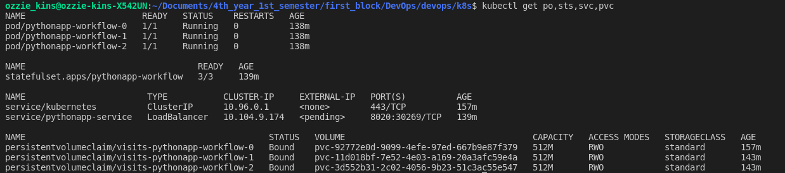

# K8s StatefulSet    

Name: Ozioma Okonicha  
Group: B18-SE01  
Lab 13   

## Updating helm chart   

Result of `kubectl get po,sts,svc,pvc`:  
```
NAME                       READY   STATUS    RESTARTS   AGE
pod/pythonapp-workflow-0   1/1     Running   0          91s
pod/pythonapp-workflow-1   1/1     Running   0          89s
pod/pythonapp-workflow-2   1/1     Running   0          85s

NAME                                  READY   AGE
statefulset.apps/pythonapp-workflow   3/3     91s

NAME                        TYPE           CLUSTER-IP     EXTERNAL-IP   PORT(S)          AGE
service/kubernetes          ClusterIP      10.96.0.1      <none>        443/TCP          16m
service/pythonapp-service   LoadBalancer   10.98.90.175   <pending>     8020:32600/TCP   91s

NAME                                                STATUS   VOLUME                                     CAPACITY   ACCESS MODES   STORAGECLASS   AGE
persistentvolumeclaim/visits-pythonapp-workflow-0   Bound    pvc-92772e0d-9099-4efe-97ed-667b9e87f379   512M       RWO            standard       15m
persistentvolumeclaim/visits-pythonapp-workflow-1   Bound    pvc-11d018bf-7e52-4e03-a169-20a3afc59e4a   512M       RWO            standard       89s
persistentvolumeclaim/visits-pythonapp-workflow-2   Bound    pvc-3d552b31-2c02-4056-9b23-51c3ac55e547   512M       RWO            standard       85s
```

  


Content of my file, in each pod `kubectl exec pod/pythonapp-workflow-0 -- cat pythonapp/logs/visits.log`:  
```sh
INFO 2021-10-04 15:11:59,390 views 18 A client visited
INFO 2021-10-04 15:22:24,308 views 18 A client visited
INFO 2021-10-04 15:22:27,369 views 18 A client visited
INFO 2021-10-04 15:22:42,432 views 18 A client visited
INFO 2021-10-04 15:22:47,560 views 18 A client visited
INFO 2021-10-04 15:22:57,846 views 18 A client visited
INFO 2021-10-04 15:22:59,569 views 18 A client visited
INFO 2021-10-04 15:23:49,369 views 18 A client visited
INFO 2021-10-04 15:24:04,079 views 18 A client visited
INFO 2021-10-04 15:24:27,564 views 18 A client visited
INFO 2021-10-04 15:24:28,906 views 18 A client visited
```

  


Content of my file, in each pod `kubectl exec pod/pythonapp-workflow-1 -- cat pythonapp/logs/visits.log`:  
```sh
INFO 2021-10-04 15:12:28,065 views 18 A client visited
INFO 2021-10-04 15:12:29,751 views 18 A client visited
INFO 2021-10-04 15:12:30,328 views 18 A client visited
INFO 2021-10-04 15:12:30,776 views 18 A client visited
INFO 2021-10-04 15:14:03,860 views 18 A client visited
INFO 2021-10-04 15:14:07,948 views 18 A client visited
INFO 2021-10-04 15:14:08,640 views 18 A client visited
INFO 2021-10-04 15:14:10,693 views 18 A client visited
INFO 2021-10-04 15:14:11,190 views 18 A client visited
INFO 2021-10-04 15:14:16,749 views 18 A client visited
INFO 2021-10-04 15:14:17,758 views 18 A client visited
INFO 2021-10-04 15:14:18,641 views 18 A client visited
INFO 2021-10-04 15:14:24,035 views 18 A client visited
INFO 2021-10-04 15:14:25,912 views 18 A client visited
INFO 2021-10-04 15:14:26,992 views 18 A client visited
INFO 2021-10-04 15:14:27,560 views 18 A client visited
INFO 2021-10-04 15:14:30,869 views 18 A client visited
INFO 2021-10-04 15:14:31,435 views 18 A client visited
INFO 2021-10-04 15:14:33,317 views 18 A client visited
INFO 2021-10-04 15:18:53,677 views 18 A client visited
INFO 2021-10-04 15:18:58,932 views 18 A client visited
INFO 2021-10-04 15:19:01,278 views 18 A client visited
INFO 2021-10-04 15:19:03,086 views 18 A client visited
INFO 2021-10-04 15:19:08,513 views 18 A client visited
INFO 2021-10-04 15:19:17,220 views 18 A client visited
INFO 2021-10-04 15:19:17,961 views 18 A client visited
INFO 2021-10-04 15:19:22,811 views 18 A client visited
INFO 2021-10-04 15:19:26,157 views 18 A client visited
INFO 2021-10-04 15:22:09,870 views 18 A client visited
INFO 2021-10-04 15:22:20,278 views 18 A client visited
INFO 2021-10-04 15:22:20,937 views 18 A client visited
INFO 2021-10-04 15:22:50,758 views 18 A client visited
INFO 2021-10-04 15:22:52,921 views 18 A client visited
INFO 2021-10-04 15:23:38,742 views 18 A client visited
INFO 2021-10-04 15:23:43,259 views 18 A client visited
INFO 2021-10-04 15:23:44,955 views 18 A client visited
INFO 2021-10-04 15:23:46,938 views 18 A client visited
INFO 2021-10-04 15:25:24,292 views 18 A client visited
INFO 2021-10-04 15:25:26,220 views 18 A client visited
INFO 2021-10-04 15:25:47,326 views 18 A client visited
INFO 2021-10-04 15:25:56,244 views 18 A client visited
INFO 2021-10-04 15:26:00,562 views 18 A client visited
INFO 2021-10-04 15:26:20,542 views 18 A client visited
INFO 2021-10-04 15:26:22,574 views 18 A client visited
INFO 2021-10-04 15:26:25,383 views 18 A client visited
```

  


Content of my file, in each pod `kubectl exec pod/pythonapp-workflow-2 -- cat pythonapp/logs/visits.log`:  
```sh
INFO 2021-10-04 15:12:14,192 views 18 A client visited
```

  


## Differences between the output of the command for replicas  

The K8s deployment works fine if we have only one single replica. However, if there were multiple replicas running, we will encounter problems.

When using StatefulSet and PersistentVolumeClaim, use the `volumeClaimTemplates`: field in the StatefulSet. The `volumeClaimTemplates:` will be used to create unique PVCs for each replica, and they have unique naming ending with e.g. `-0` where the number is an ordinal used for the replicas in a StatefulSet.

The reason for the difference in output is that when using statefulsets, each pod is created with a unique identifier and also each pod has its own persistent volume claim as specified in our template.

## Parallel launch

In order to launch or terminate all Pods in parallel, we just add `podManagementPolicy: "Parallel"` to our statefulSet and the result is as follows:  
Result of `kubectl get po,sts,svc,pvc`:  
```
NAME                       READY   STATUS    RESTARTS   AGE
pod/pythonapp-workflow-0   1/1     Running   0          138m
pod/pythonapp-workflow-1   1/1     Running   0          138m
pod/pythonapp-workflow-2   1/1     Running   0          138m

NAME                                  READY   AGE
statefulset.apps/pythonapp-workflow   3/3     139m

NAME                        TYPE           CLUSTER-IP     EXTERNAL-IP   PORT(S)          AGE
service/kubernetes          ClusterIP      10.96.0.1      <none>        443/TCP          157m
service/pythonapp-service   LoadBalancer   10.104.9.174   <pending>     8020:30269/TCP   139m

NAME                                                STATUS   VOLUME                                     CAPACITY   ACCESS MODES   STORAGECLASS   AGE
persistentvolumeclaim/visits-pythonapp-workflow-0   Bound    pvc-92772e0d-9099-4efe-97ed-667b9e87f379   512M       RWO            standard       157m
persistentvolumeclaim/visits-pythonapp-workflow-1   Bound    pvc-11d018bf-7e52-4e03-a169-20a3afc59e4a   512M       RWO            standard       143m
persistentvolumeclaim/visits-pythonapp-workflow-2   Bound    pvc-3d552b31-2c02-4056-9b23-51c3ac55e547   512M       RWO            standard       143m
```

 


For our app ordering guarantee are unnecessary. This is because there is no unique logic we are trying to preserve and the data used by the pods are not dependent on each other or affect anything; it is identical, hence we don't need the ordering.
