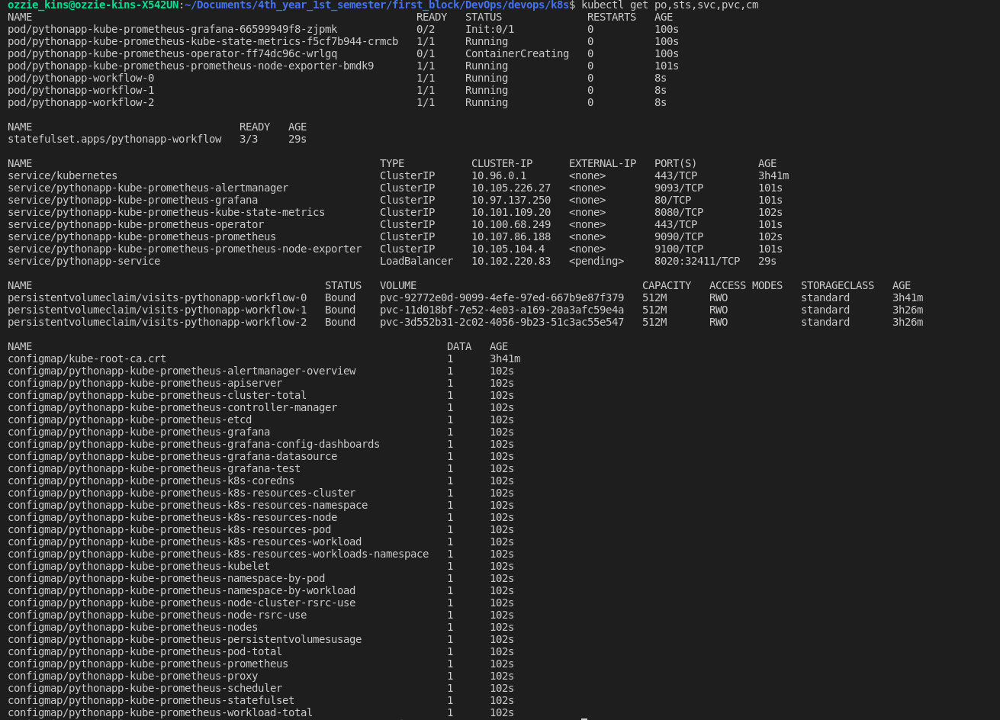
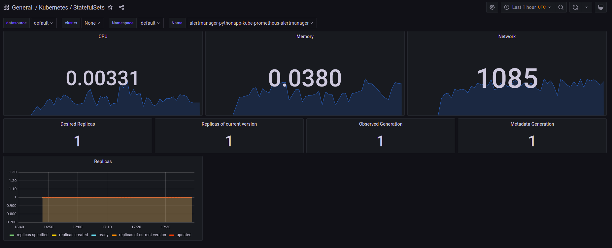
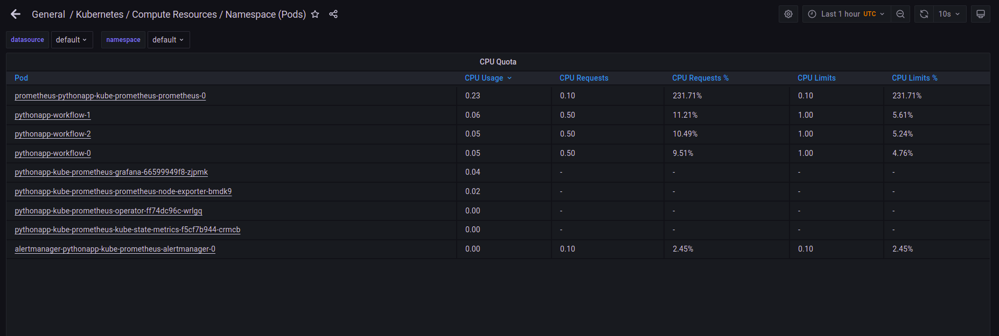
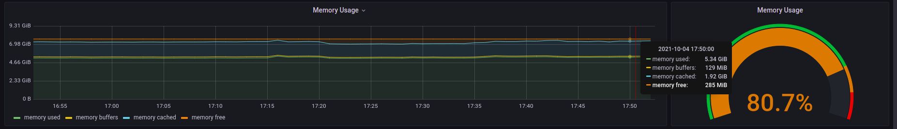
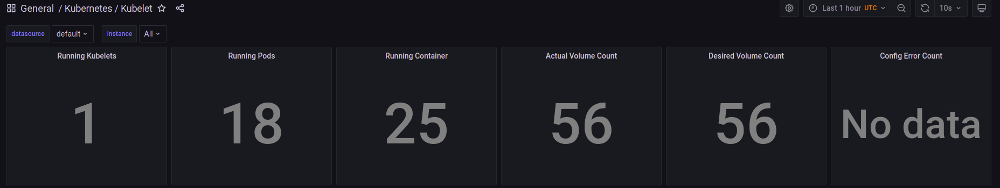
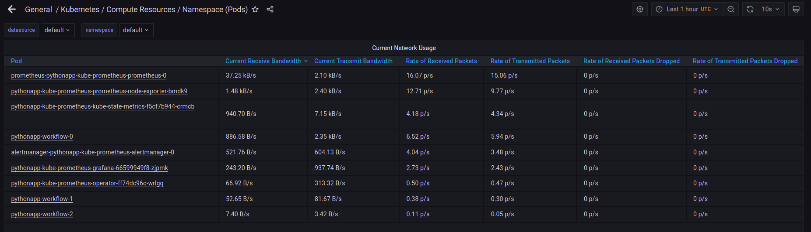
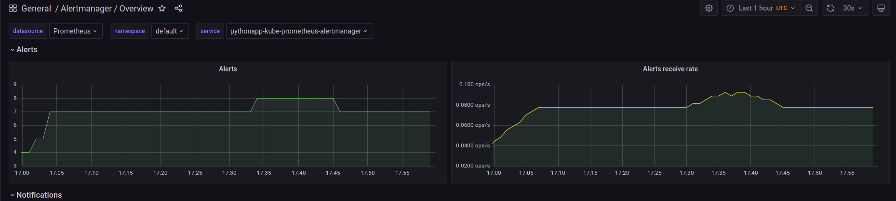
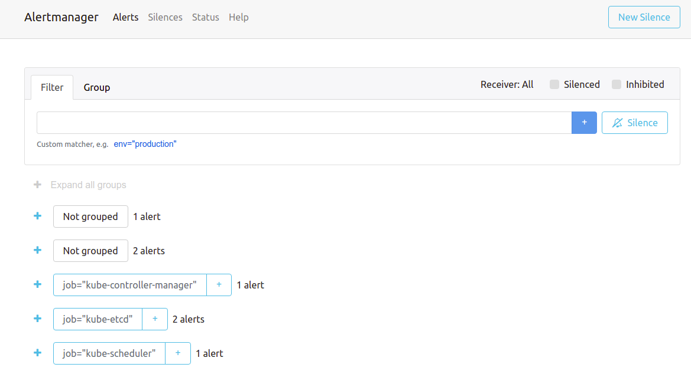
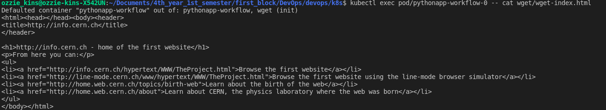

# K8s Prometheus stack    

Name: Ozioma Okonicha  
Group: B18-SE01  
Lab 14   

## Components  

1. **Prometheus Operator**

    This component simply manages kubernetes prometheus clusters. It uses kubernetes elements such as its custom resources to configure prometheus and alertmanager basics. So if you are familiar with kubernetes, you can just use it and enjoy the benefits of promortheus.  

2. **Prometheus**

    If we want to monitor our running cluster, it is wise to use a persistent storage so that metrics can survive restarts. So this component simply gathers these metrics.    

3. **Alertmanager**

    If we want to monitor our running cluster, it is wise to use a persistent storage so that alerts can survive restarts. So this component simply gathers these alerts.  

4. **Node-exporter**

    This component is an exporter that gathers metrics gotten from the system/machine resources; the memory the CPU etc.  

5. **Prometheus Adapter for K8s Metrics APIs**

    Kubernetes typically uses some customized metrics for its Horizontal Pod Autoscaling. This helps to scale workloads based on the custom metric and this component is responsible for connecting them.  

6. **kube-state-metrics**

    It listens to the k8s API and generates metrics concerning the deployments, pods, services, statefulsets...etc.  

7. **Grafana**

    This component is like the frontend interface to promotheus' backend interface. It allows for visual analysis.  


Result of `kubectl get po,sts,svc,pvc,cm`:  
```
NAME                                                               READY   STATUS              RESTARTS   AGE
pod/pythonapp-kube-prometheus-grafana-66599949f8-zjpmk             0/2     Init:0/1            0          100s
pod/pythonapp-kube-prometheus-kube-state-metrics-f5cf7b944-crmcb   1/1     Running             0          100s
pod/pythonapp-kube-prometheus-operator-ff74dc96c-wrlgq             0/1     ContainerCreating   0          100s
pod/pythonapp-kube-prometheus-prometheus-node-exporter-bmdk9       1/1     Running             0          101s
pod/pythonapp-workflow-0                                           1/1     Running             0          8s
pod/pythonapp-workflow-1                                           1/1     Running             0          8s
pod/pythonapp-workflow-2                                           1/1     Running             0          8s

NAME                                  READY   AGE
statefulset.apps/pythonapp-workflow   3/3     29s

NAME                                                         TYPE           CLUSTER-IP      EXTERNAL-IP   PORT(S)          AGE
service/kubernetes                                           ClusterIP      10.96.0.1       <none>        443/TCP          3h41m
service/pythonapp-kube-prometheus-alertmanager               ClusterIP      10.105.226.27   <none>        9093/TCP         101s
service/pythonapp-kube-prometheus-grafana                    ClusterIP      10.97.137.250   <none>        80/TCP           101s
service/pythonapp-kube-prometheus-kube-state-metrics         ClusterIP      10.101.109.20   <none>        8080/TCP         102s
service/pythonapp-kube-prometheus-operator                   ClusterIP      10.100.68.249   <none>        443/TCP          101s
service/pythonapp-kube-prometheus-prometheus                 ClusterIP      10.107.86.188   <none>        9090/TCP         102s
service/pythonapp-kube-prometheus-prometheus-node-exporter   ClusterIP      10.105.104.4    <none>        9100/TCP         101s
service/pythonapp-service                                    LoadBalancer   10.102.220.83   <pending>     8020:32411/TCP   29s

NAME                                                STATUS   VOLUME                                     CAPACITY   ACCESS MODES   STORAGECLASS   AGE
persistentvolumeclaim/visits-pythonapp-workflow-0   Bound    pvc-92772e0d-9099-4efe-97ed-667b9e87f379   512M       RWO            standard       3h41m
persistentvolumeclaim/visits-pythonapp-workflow-1   Bound    pvc-11d018bf-7e52-4e03-a169-20a3afc59e4a   512M       RWO            standard       3h26m
persistentvolumeclaim/visits-pythonapp-workflow-2   Bound    pvc-3d552b31-2c02-4056-9b23-51c3ac55e547   512M       RWO            standard       3h26m

NAME                                                                    DATA   AGE
configmap/kube-root-ca.crt                                              1      3h41m
configmap/pythonapp-kube-prometheus-alertmanager-overview               1      102s
configmap/pythonapp-kube-prometheus-apiserver                           1      102s
configmap/pythonapp-kube-prometheus-cluster-total                       1      102s
configmap/pythonapp-kube-prometheus-controller-manager                  1      102s
configmap/pythonapp-kube-prometheus-etcd                                1      102s
configmap/pythonapp-kube-prometheus-grafana                             1      102s
configmap/pythonapp-kube-prometheus-grafana-config-dashboards           1      102s
configmap/pythonapp-kube-prometheus-grafana-datasource                  1      102s
configmap/pythonapp-kube-prometheus-grafana-test                        1      102s
configmap/pythonapp-kube-prometheus-k8s-coredns                         1      102s
configmap/pythonapp-kube-prometheus-k8s-resources-cluster               1      102s
configmap/pythonapp-kube-prometheus-k8s-resources-namespace             1      102s
configmap/pythonapp-kube-prometheus-k8s-resources-node                  1      102s
configmap/pythonapp-kube-prometheus-k8s-resources-pod                   1      102s
configmap/pythonapp-kube-prometheus-k8s-resources-workload              1      102s
configmap/pythonapp-kube-prometheus-k8s-resources-workloads-namespace   1      102s
configmap/pythonapp-kube-prometheus-kubelet                             1      102s
configmap/pythonapp-kube-prometheus-namespace-by-pod                    1      102s
configmap/pythonapp-kube-prometheus-namespace-by-workload               1      102s
configmap/pythonapp-kube-prometheus-node-cluster-rsrc-use               1      102s
configmap/pythonapp-kube-prometheus-node-rsrc-use                       1      102s
configmap/pythonapp-kube-prometheus-nodes                               1      102s
configmap/pythonapp-kube-prometheus-persistentvolumesusage              1      102s
configmap/pythonapp-kube-prometheus-pod-total                           1      102s
configmap/pythonapp-kube-prometheus-prometheus                          1      102s
configmap/pythonapp-kube-prometheus-proxy                               1      102s
configmap/pythonapp-kube-prometheus-scheduler                           1      102s
configmap/pythonapp-kube-prometheus-statefulset                         1      102s
configmap/pythonapp-kube-prometheus-workload-total                      1      102s
```

  

This command is showing the output for all pods, statistics, services, persistent volume claims and configmaps in our cluster.  

## Results from grafana dashboard  

1. My StatefulSet is consuming _0.00331_ of the CPU and _0.0380_ of the memory  

  

2. The pod that is using more CPU than others in the default namespace is `prometheus-python-prometheus-prometheus-0` with usage of _0.23_ and my image pods `pythonapp-workflow-0, pythonapp-workflow-1` and `pythonapp-workflow-2` are using only _0.05, 0.06_ and_0.05_  

   

3. On my node _80.7%_ memory which is _5.34Gi_ is used  

  

4. _18_ pods and _25_ containers were ran by the Kubelet service.  

  

5. The pod that is using more network than others in the default namespace is `prometheus-python-prometheus-prometheus-0` with usage of _37.25 Kb/s_ and my image pods `pythonapp-workflow-0, pythonapp-workflow-1` and `pythonapp-workflow-2` are using only _886.58 B/s, 52.65 B/s_ and _7.40 B/s_ respectively

  

6. I have 7 alerts as shown here  

  

On the alertmanager Web UI, it is elaborated as follows  

  


## Init containers  

Result of `kubectl exec pod/pythonapp-workflow-0 -- cat wget/wget-index.html` :

```html
Defaulted container "pythonapp-workflow" out of: pythonapp-workflow, wget (init)
<html><head></head><body><header>
<title>http://info.cern.ch</title>
</header>

<h1>http://info.cern.ch - home of the first website</h1>
<p>From here you can:</p>
<ul>
<li><a href="http://info.cern.ch/hypertext/WWW/TheProject.html">Browse the first website</a></li>
<li><a href="http://line-mode.cern.ch/www/hypertext/WWW/TheProject.html">Browse the first website using the line-mode browser simulator</a></li>
<li><a href="http://home.web.cern.ch/topics/birth-web">Learn about the birth of the web</a></li>
<li><a href="http://home.web.cern.ch/about">Learn about CERN, the physics laboratory where the web was born</a></li>
</ul>
</body></html>
```
  