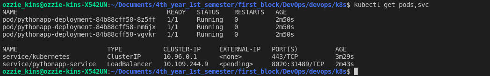
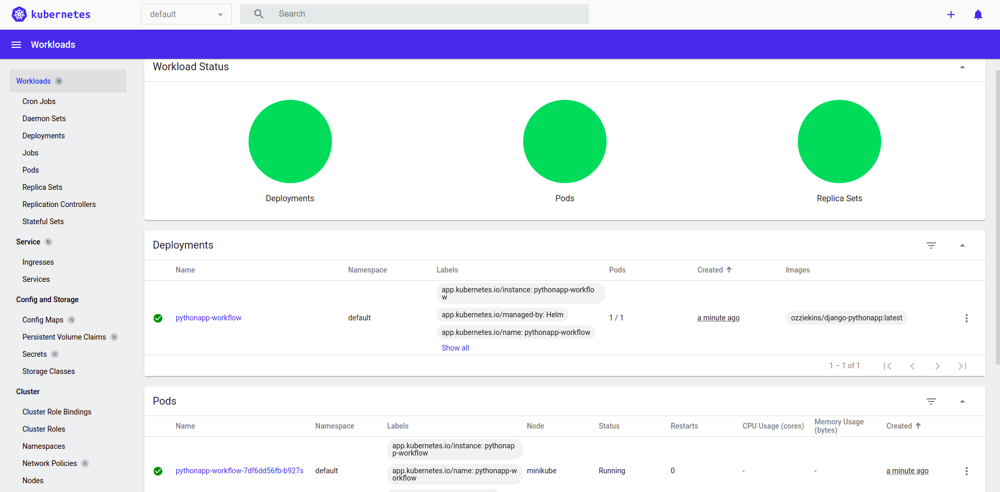
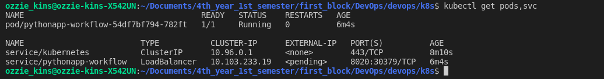

# Kubernetes & Helm    

Name: Ozioma Okonicha  
Group: B18-SE01  
Lab 9&10  

## Lab 9   
Kubernetes  

### Using CLI  

```sh
minikube start
kubectl get po -A
kubectl create deployment pythonapp --image=ozziekins/django-pythonapp:latest
kubectl expose deployment pythonapp --type=LoadBalancer --target-port=8020 --port=8020
kubectl get deployments
kubectl get services pods
kubectl get services events
kubectl config view
kubectl get services
minikube service pythonapp
```

Result of `kubectl get pods,svc`:  
```
NAME                             READY   STATUS    RESTARTS   AGE
pod/pythonapp-67887d4457-xhhgp   1/1     Running   0          77s

NAME                 TYPE           CLUSTER-IP       EXTERNAL-IP   PORT(S)          AGE
service/kubernetes   ClusterIP      10.96.0.1        <none>        443/TCP          98s
service/pythonapp    LoadBalancer   10.109.120.240   <pending>     8020:30366/TCP   68s
```

  


### Using config files   

```sh
minikube start
kubectl apply -f deployment.yml
kubectl apply -f service.yml
minikube service pythonapp-service
```

Result of `kubectl get pods,svc`:  
```
NAME                                        READY   STATUS    RESTARTS   AGE
pod/pythonapp-deployment-84b88cff58-8z5ff   1/1     Running   0          2m50s
pod/pythonapp-deployment-84b88cff58-nm6jx   1/1     Running   0          2m50s
pod/pythonapp-deployment-84b88cff58-vgvkr   1/1     Running   0          2m50s

NAME                        TYPE           CLUSTER-IP     EXTERNAL-IP   PORT(S)          AGE
service/kubernetes          ClusterIP      10.96.0.1      <none>        443/TCP          3m29s
service/pythonapp-service   LoadBalancer   10.109.244.9   <pending>     8020:31489/TCP   2m43s
```

  


## Lab 10
Helm  

### Dashboard

  

### Helm chart  

```sh
minikube start
helm package pythonapp-workflow
helm install pythonapp-workflow ./pythonapp-workflow-0.1.0.tgz 
minikube service pythonapp-workflow
```

Result of `kubectl get pods,svc`:
```
NAME                                      READY   STATUS    RESTARTS   AGE
pod/pythonapp-workflow-54df7bf794-782ft   1/1     Running   0          6m4s

NAME                         TYPE           CLUSTER-IP      EXTERNAL-IP   PORT(S)          AGE
service/kubernetes           ClusterIP      10.96.0.1       <none>        443/TCP          8m10s
service/pythonapp-workflow   LoadBalancer   10.103.233.19   <pending>     8020:30379/TCP   6m4s
```
 
