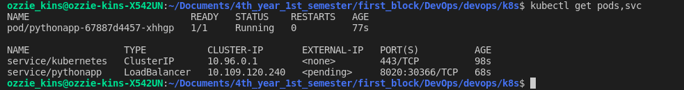

# Kubernetes  

Name: Ozioma Okonicha  
Group: B18-SE01  
Lab 9 

## Using CLI  

```sh
minikube start
kubectl get po -A
kubectl create deployment pythonapp --image=ozziekins/django-pythonapp:latest
kubectl expose deployment pythonapp --type=LoadBalancer --target-port=8020 --port=8020
kubectl get deployments
kubectl get services pods
kubectl get services events
kubectl config view
kubectl get services
minikube service pythonapp
```

Result of `kubectl get pods`:  
```
NAME                         READY   STATUS    RESTARTS   AGE
pythonapp-67887d4457-xj2wq   1/1     Running   0          12m
```

Result of `kubectl get services`:  
```
NAME         TYPE           CLUSTER-IP       EXTERNAL-IP   PORT(S)          AGE
kubernetes   ClusterIP      10.96.0.1        <none>        443/TCP          13m
pythonapp    LoadBalancer   10.104.125.174   <pending>     8020:30571/TCP   12m
```

  


## Using config files   

```sh
minikube start
kubectl apply -f deployment.yml
kubectl apply -f service.yml
```

Result of `kubectl get pods`:  
```
NAME                                    READY   STATUS    RESTARTS   AGE
pythonapp-deployment-84b88cff58-5l8mr   1/1     Running   0          2m8s
pythonapp-deployment-84b88cff58-csjhb   1/1     Running   0          2m8s
pythonapp-deployment-84b88cff58-x4m9v   1/1     Running   0          2m8s
```

Result of `kubectl get services`:  
```
NAME                TYPE           CLUSTER-IP      EXTERNAL-IP   PORT(S)          AGE
kubernetes          ClusterIP      10.96.0.1       <none>        443/TCP          3m50s
pythonapp-service   LoadBalancer   10.100.73.182   <pending>     8020:30774/TCP   2m14s
```

  