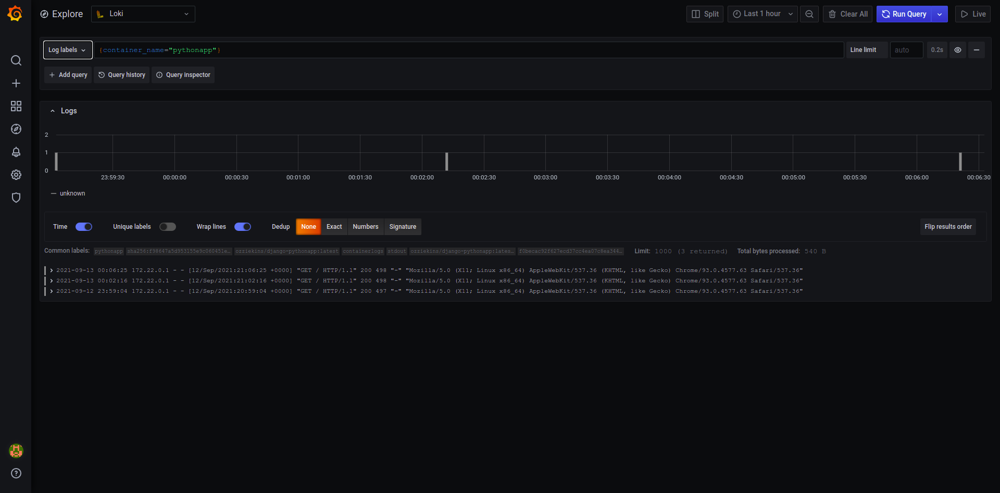
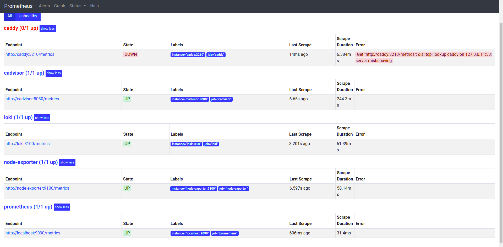

# Best Logging practices

Name: Ozioma Okonicha

Group: B18-SE01

## Lab 7 

Logging..why do we need it anyway? to get an understanding of how your code works, to capture and fix unexpected errors, to analyze and visualize how the app performs. After doing some research, I found the following best practices for logging in general:  

- Use a standard and easily configurable logging framework.  
- Use a logging framework with flexible output options.  
- Use a standard structured format like JSON.  
- Create a standard schema for your fields.  
- Don't let logging block your application.  
- Use a standard library or wrapper for portability.  
- Beware that environments like Heroku and Docker set restrictions on host access, syslog daemons, and more  
- Automatically parse your logs at ingestion.  
- Set up common searches, dashboards, and alerts for your team.  

### Grafana-loki  

For this framework specifically, I found the following best practices:  

- Static labels are good  
- Use dynamic labels sparingly  
- Label values must always be bounded  
- Be aware of dynamic labels applied by clients (like promtail)  
- Configure caching  
- Logs must be in increasing time order per stream  
- Use ```chunk_target_size```  
- Use ```-print-config-stderr``` or ```-log-config-reverse-order```  

Screenshot:
  


## Lab 8  

Screenshots:  

```http://localhost:9090/targets```  

  

Loki2.0 Global Metrics Dashboard (```https://grafana.com/grafana/dashboards/13407```)  
 
 ./images/screen_record3.mp4  

 Prometheus 2.0 Overview Dashbaord (```https://grafana.com/grafana/dashboards/3662```)  
 
./images/screen_record4.mp4  